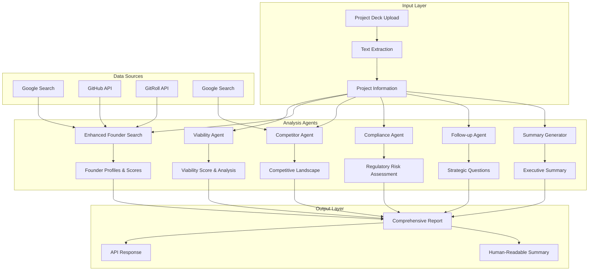
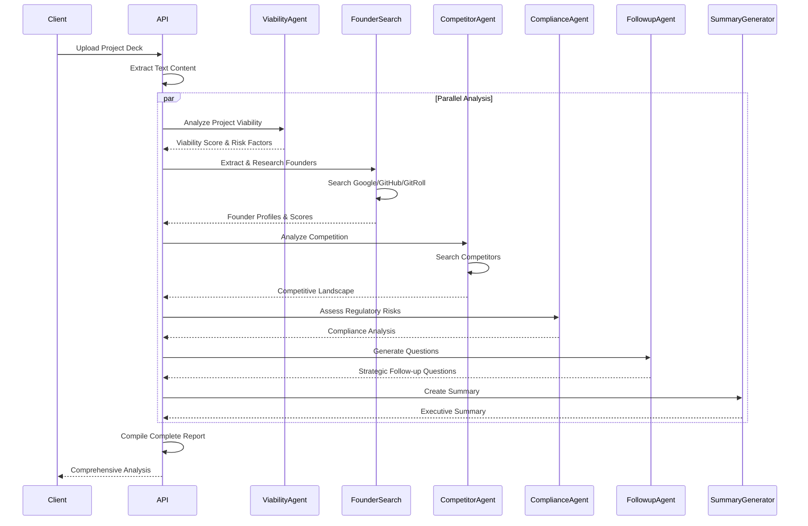
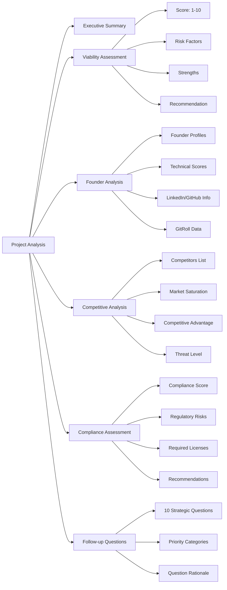

# MoneyMule.xyz - Multi-Agent Investment Analysis Platform

> **Tool for early stage investors** | ETH Global Cannes 2025 | Backend Repository

A sophisticated multi-agent system designed to analyze startup projects, evaluate founders, and provide comprehensive investment insights for early-stage investors.

## 🚀 Overview

MoneyMule.xyz leverages advanced AI agents to automate the due diligence process, providing investors with detailed analysis of:
- **Project viability and market potential**
- **Founder background and technical expertise**
- **Competitive landscape and market positioning**
- **Compliance and regulatory risks**
- **Strategic follow-up questions for meetings**

## 🤖 Agent Architecture



## 🔄 Agent Workflow



## 🎯 Agent Capabilities

### 1. **Viability Agent** 
- **Purpose**: Evaluate project viability and investment potential
- **Output**: Score (1-10) with detailed explanation, risk factors, strengths
- **Scoring Criteria**: Team strength, market size, technology, business model, execution capability
- **Features**: Stricter scoring with penalties for high risks, bonuses for strong teams

### 2. **Enhanced Founder Search**
- **Purpose**: Extract and analyze founder information from project decks
- **Data Sources**: Google Search, GitHub API, GitRoll API
- **Output**: Founder profiles with technical/business scores, LinkedIn profiles, GitHub activity
- **Scoring**: Technical expertise (0-10), Business acumen (0-10), Overall score (0-10)

### 3. **Competitor Agent**
- **Purpose**: Analyze competitive landscape and market positioning
- **Data Sources**: Google Search for competitor identification
- **Output**: Competitor list, market saturation, competitive advantage, threat level
- **Analysis**: Market gaps, key differentiators, strategic recommendations

### 4. **Compliance Agent**
- **Purpose**: Identify legal and regulatory risks
- **Coverage**: Data privacy, financial regulations, industry-specific compliance
- **Output**: Compliance score, risk level, required licenses, recommendations
- **Areas**: GDPR/CCPA, IP risks, employment law, cybersecurity regulations

### 5. **Follow-up Agent**
- **Purpose**: Generate strategic questions for investor meetings
- **Output**: 10 critical follow-up questions categorized by priority
- **Categories**: Team & Execution, Market & Competition, Technology & Product, Business Model & Financials, Risk & Mitigation
- **Focus**: Questions that reveal true potential and risks

### 6. **Summary Generator**
- **Purpose**: Create concise executive summaries
- **Output**: One-line summary in English
- **Focus**: Key value proposition and market opportunity

## 📊 Analysis Output Structure



## 🛠️ Technical Stack

- **Backend**: Python, FastAPI, CrewAI
- **AI Models**: OpenAI GPT-4o-mini
- **APIs**: GitHub API, GitRoll API, Google Search
- **File Processing**: PDF, PPTX, DOCX, TXT, MD
- **Deployment**: Docker, Docker Compose

## 🚀 Quick Start

1. **Clone the repository**
   ```bash
   git clone <repository-url>
   cd money-mule-multiagent
   ```

2. **Set up environment**
   ```bash
   # Copy environment template
   cp .env.example .env
   
   # Add your API keys
   OPENAI_API_KEY=your_openai_key
   GITHUB_TOKEN=your_github_token
   GITROLL_API_KEY=your_gitroll_key
   ```

3. **Install dependencies**
   ```bash
   pip install -r requirements.txt
   ```

4. **Start the server**
   ```bash
   python -m uvicorn app.main:app --reload
   ```

5. **Upload a project deck**
   ```bash
   curl -X POST "http://localhost:8000/analysis/project/upload" \
        -F "file=@your_project_deck.pdf"
   ```

## 📡 API Endpoints

- `POST /analysis/project/upload` - Upload project deck for comprehensive analysis
- `POST /analysis/project/simple` - Get human-readable summary
- `POST /document/analyze` - Analyze any VC document (Term Sheet, SAFE, SAFT, SPA, Shareholders' Agreement, Cap Table, Due Diligence, KYC, etc.) and get a risk summary and score

```mermaid
graph TD
    A[Usuario sube documento (PDF, DOCX, TXT, MD)] --> B[API /document/analyze]
    B --> C[Extracción de texto]
    C --> D[Detección de tipo de documento]
    D --> E[División en fragmentos]
    E --> F[Extracción de cláusulas de riesgo]
    F --> G[Evaluación de riesgos por cláusula]
    G --> H[Cálculo de score global]
    H --> I[Resumen de riesgos y score]
    I --> J[Respuesta al usuario]
```

- `GET /followup-questions` - Generate follow-up questions only
- `GET /` - List all available endpoints and agents

## 🎯 Use Cases

### For Investors
- **Due Diligence Automation**: Quickly assess multiple projects
- **Founder Evaluation**: Technical and business expertise scoring
- **Market Analysis**: Competitive landscape and positioning
- **Risk Assessment**: Compliance and regulatory risk identification
- **Meeting Preparation**: Strategic follow-up questions

### For Startups
- **Self-Assessment**: Understand investor perspective
- **Gap Analysis**: Identify areas for improvement
- **Competitive Intelligence**: Market positioning insights
- **Compliance Preparation**: Regulatory requirement identification

## 🔧 Configuration

The system is highly configurable through environment variables:

- `OPENAI_API_KEY`: OpenAI API key for AI analysis
- `GITHUB_TOKEN`: GitHub API token for founder research
- `GITROLL_API_KEY`: GitRoll API key for developer insights
- `LOG_LEVEL`: Logging level (DEBUG, INFO, WARNING, ERROR)

## 📈 Performance

- **Processing Time**: 30-60 seconds for comprehensive analysis
- **Concurrent Requests**: Supports multiple simultaneous analyses
- **File Size Limit**: Up to 50MB per upload
- **Supported Formats**: PDF, PPTX, DOCX, TXT, MD

## 🤝 Contributing

This project is part of ETH Global Cannes 2025. Contributions are welcome!

1. Fork the repository
2. Create a feature branch
3. Make your changes
4. Add tests if applicable
5. Submit a pull request

## 📄 License

This project is licensed under the MIT License - see the LICENSE file for details.

## 🙏 Acknowledgments

- **ETH Global Cannes 2025** for the hackathon opportunity
- **OpenAI** for providing the AI models
- **GitHub** and **GitRoll** for developer data APIs
- **FastAPI** and **CrewAI** communities for the excellent frameworks

---

**Built with ❤️ for the Ethereum ecosystem** 